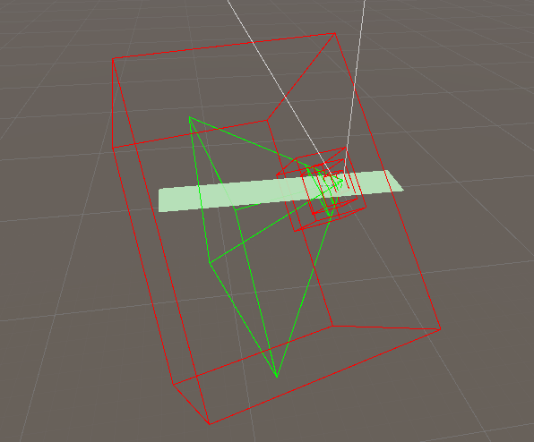
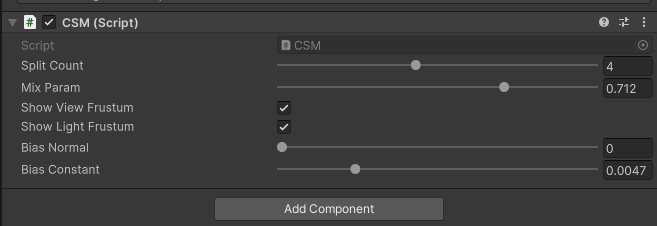
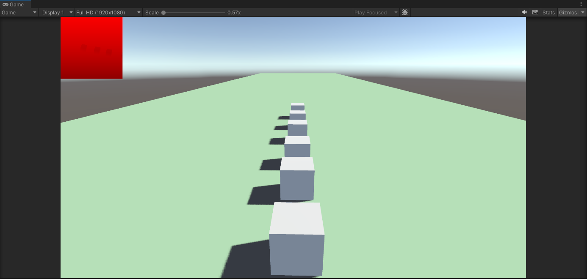

# unity-shadow-impl
Use unity to implement some shadow algorithms

Support visualized frustum.

Support multiple setting options.

Implemented PCF-based soft shadows, solved the shimmering caused by camera movement, and supported shadow blending.

